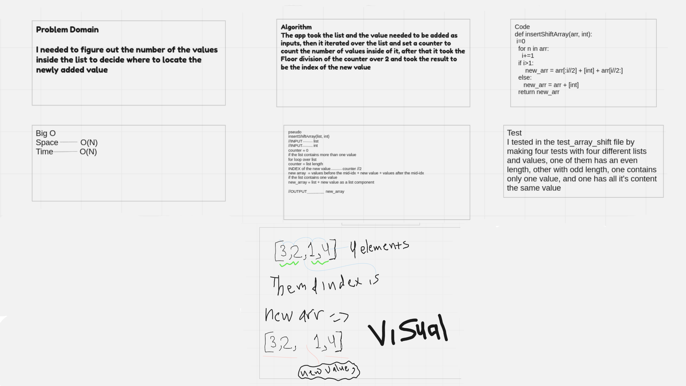

# Challenges

* Reverse an Array

I was asked to reverse a list using Python

* Challenge

The challenge is about taking an input list and returning it in the reversed order

* Approach & Efficiency

I used for loop to iterate through the list and push each element to the end.
I guess it is O(N)

* Solution

## Array shift

 I was asked to add a value in the middle of a list.

* Challenge

The challenge is about taking two inputs a list and a value and adding the value in the middle of the list

* Approach & Efficiency

I used for loop to find out the middle of the list the added the value as an index of the list

O(N)

* Solution

