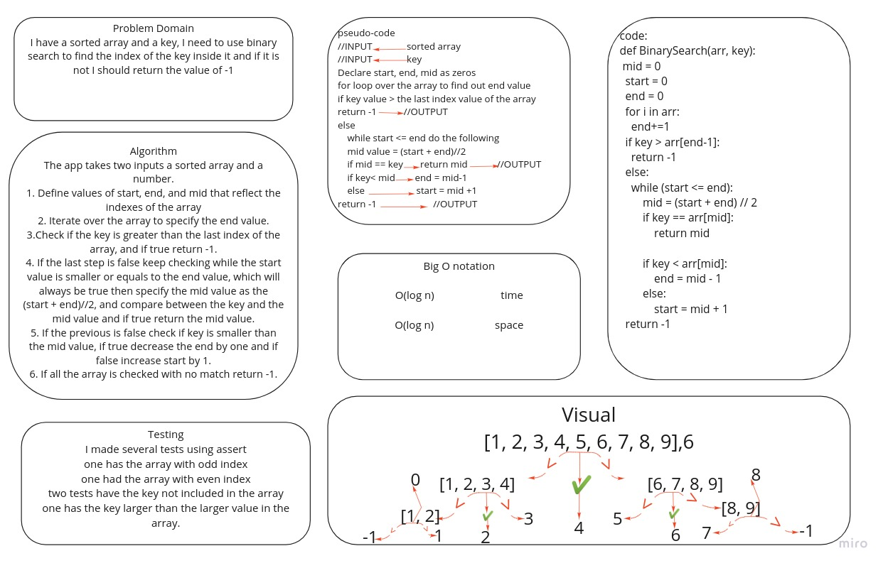
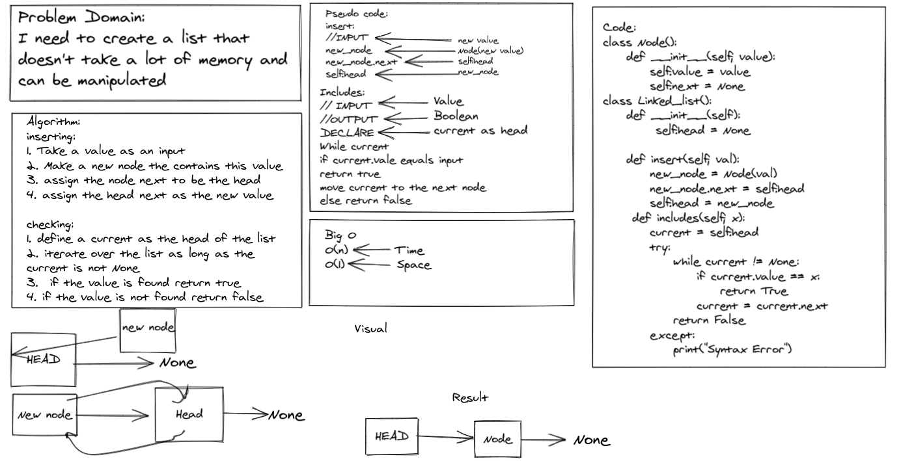

# Challenges

* Reverse an Array

I was asked to reverse a list using Python

* Challenge

The challenge is about taking an input list and returning it in the reversed order

* Approach & Efficiency

I used for loop to iterate through the list and push each element to the end.
I guess it is O(N)

* Solution

## Array shift

 I was asked to add a value in the middle of a list.

* Challenge

The challenge is about taking two inputs a list and a value and adding the value in the middle of the list

* Approach & Efficiency

I used for loop to find out the middle of the list the added the value as an index of the list

O(N)

* Solution

## Binary Search

find out the index if the input value inside the input array using binary search

* Challenge
the challenge was about dealing with numbers that are greater than the last index

* Approach and efficacy
I used for loop to find the length of the array, then while loop to compare between med and value more than once.

* solution

## linked list

I was asked to create a linked list that I can insert into, check a value inside, and it should return a string of contents

* Challenge

The challenge is that it is a new thing to know, I even don't think I completely get it, but it will get better

* Approach & Efficiency

for the insertion I used O(1) method which inserts at the beginning of the list
and for the includes method, i used Traversal

O(N)

* Solution

