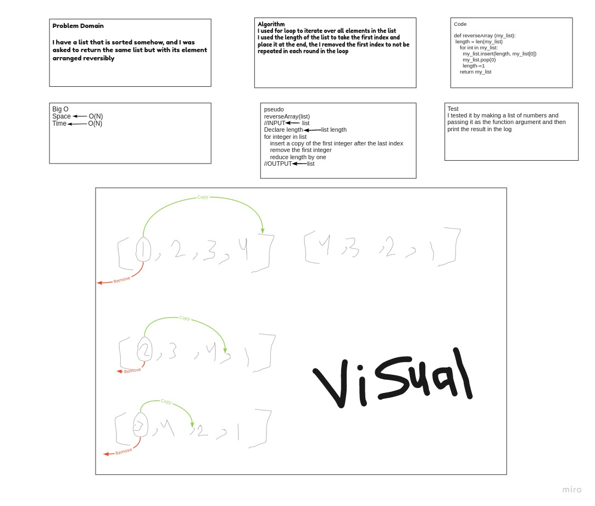

# Reverse an Array

 I was asked to reverse a list using Python

## Challenge

The challenge is about taking an input list and returning it in the reversed order

## Approach & Efficiency

I used for loop to iterate through the list and push each element to the end.
I guess it is O(N)

## Solution

